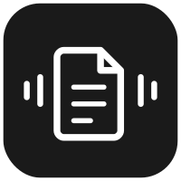

<p align="center">
  
</p>

<h1 align="center">AuraPDF</h1>

<p align="center">
  Offline PDF reader for Android with near-human TTS, smart content filtering, auto-scroll sync, and offline translation.
</p>

<p align="center">
  
  
  
  
</p>

---

## Features

- **Smart Content Filter** — intelligently reads paragraphs and titles while skipping headers, footers, page numbers, and layout noise
- **Text-to-Speech** — Android TTS with word-boundary sync, foreground service for background playback
- **Auto-Scroll & Highlight** — animated highlight tracks the currently spoken word; page auto-scrolls to follow
- **Offline Translation** — ML Kit on-device translation triggered by double-press Volume Down; configurable target language
- **Pinch-to-Zoom** — smooth 1x–5x zoom with pan support on PDF pages
- **Dark Mode** — system-aware + manual toggle; PDF pages invert for comfortable dark reading
- **SAF Integration** — open PDFs from any storage provider with persistent permissions
- **Library Management** — home screen grid with PDF thumbnails, sort by date/name/progress

## Tech Stack

| Layer | Technology |
|-------|------------|
| UI | Jetpack Compose + Material3 |
| Architecture | Clean Architecture (data / domain / presentation) |
| DI | Hilt |
| PDF Rendering | Android PdfRenderer |
| Text Extraction | PDFBox Android |
| TTS | Android TextToSpeech API |
| Translation | ML Kit On-Device Translation |
| Database | Room |
| Preferences | DataStore |

## Architecture

```
Presentation (Compose UI, TTS Controls, Translation Sheet)
   ↓
Domain (TtsEngine, ContentAnalyzer, ReadingController, TranslationEngine)
   ↓
Data (Room: Library, Position | DataStore: Smart Reading, Theme, Translation)
   ↓
System (ForegroundService, SAF, PdfRenderer, PDFBox, ML Kit)
```

## Getting Started

### Prerequisites

- Android Studio Hedgehog or later
- JDK 17
- Android SDK 34

### Build

```bash
git clone https://github.com/yossefsabry/AuraPDF.git
cd AuraPDF
./gradlew assembleDebug
```

### Install

```bash
adb install app/build/outputs/apk/debug/app-debug.apk
```

## License

This project is licensed under the MIT License — see the [LICENSE](LICENSE) file for details.
